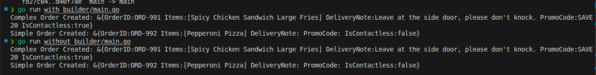

### **The General Study Case: The Intelligent Food Delivery Platform**

Imagine you are building the backend for a modern food delivery application. The system needs to handle incoming HTTP requests, manage complex user orders with endless customizations, calculate totals from complex menu structures, and track the real-time status of the delivery.

Here is how all four patterns naturally fit into this single system:

* **Middleware:** Intercepts the incoming web request to place an order. It authenticates the user, logs the activity, and validates the request payload before it ever reaches your core business logic.
* **Builder:** Constructs the highly complex `DeliveryOrder` object. A single order might have multiple food items, specific customizations (e.g., "no pickles," "extra spicy"), delivery notes, and promo codes.
* **Iterator:** Traverses the user's shopping cart. Since a cart might contain combo meals (which themselves contain sub-items like a burger, fries, and a drink), the Iterator allows the pricing system to seamlessly loop through all items, regardless of how deeply nested they are, to calculate the final total.
* **State:** Manages the lifecycle of the `DeliveryOrder`. The order shifts its behavior and available actions as it moves through states: `PendingPayment` -> `PreparingFood` -> `OutForDelivery` -> `Delivered`.

---

### **Deep Dive: The Builder Pattern (In the Context of Our Study Case)**

| **Name** | **Builder Design Pattern** (Creational) |
| --- | --- |
| **Intent/Problem** | In our food delivery app, creating an `Order` object is incredibly complex. A user might only order a pizza, or they might order a pizza, add a drink, apply a discount code, request contactless delivery, and leave a note for the driver. If we use a standard constructor function, we end up with dozens of parameters, forcing us to pass `""` or `nil` for unused options. We need a way to construct this complex order step-by-step, only specifying the parts the user actually requested. |
| **Solution** | **Static Structure:** We define an `Order` struct (the Product) and an `OrderBuilder` struct. The builder contains step-by-step methods (`AddMain()`, `AddNote()`, `ApplyPromo()`). <br>

<br>

<br>**Dynamic Behavior:** When an order request comes in, the system instantiates an `OrderBuilder`. It chains only the methods needed based on the user's request. Finally, it calls a `Build()` method, which packages all the steps together, validates them, and returns the final `Order` object ready for processing. |

### **Sample Code (Go)**

Here is how we construct a complex food delivery order without and with the Builder pattern.

#### Without Builder

```go
package main

import (
	"errors"
	"fmt"
)

// The Product
type DeliveryOrder struct {
	OrderID       string
	Items         []string
	DeliveryNote  string
	PromoCode     string
	IsContactless bool
}

// The Massive Constructor
// We have to include every possible option as a parameter here.
func NewDeliveryOrder(orderID string, items []string, deliveryNote string, promoCode string, isContactless bool) (*DeliveryOrder, error) {
	// Validation
	if len(items) == 0 {
		return nil, errors.New("cannot create order: cart is empty")
	}

	return &DeliveryOrder{
		OrderID:       orderID,
		Items:         items,
		DeliveryNote:  deliveryNote,
		PromoCode:     promoCode,
		IsContactless: isContactless,
	}, nil
}

func main() {
	// Scenario A: A complex order
	// This looks somewhat okay because we are using all the fields.
	complexOrder, err := NewDeliveryOrder(
		"ORD-991",
		[]string{"Spicy Chicken Sandwich", "Large Fries"},
		"Leave at the side door, please don't knock.",
		"SAVE20",
		true,
	)
	if err == nil {
		fmt.Printf("Complex Order Created: %+v\n", complexOrder)
	}

	// Scenario B: A simple order
	// DEMONSTRATION OF THE PROBLEM:
	// The user just wants a pizza. They don't have a note, no promo code,
	// and don't care about contactless delivery.
	// But because of our constructor, we are FORCED to pass empty strings ("") and false.
	simpleOrder, err := NewDeliveryOrder(
		"ORD-992",
		[]string{"Pepperoni Pizza"},
		"",    // What is this empty string for?
		"",    // And this one?
		false, // What does false mean here?
	)
	if err == nil {
		fmt.Printf("Simple Order Created: %+v\n", simpleOrder)
	}
}
```

#### With Builder

```go
package main

import (
	"errors"
	"fmt"
)

// 1. The Product
type DeliveryOrder struct {
	OrderID       string
	Items         []string
	DeliveryNote  string
	PromoCode     string
	IsContactless bool
}

// 2. The Builder
type OrderBuilder struct {
	order DeliveryOrder
}

func NewOrderBuilder(orderID string) *OrderBuilder {
	return &OrderBuilder{
		order: DeliveryOrder{
			OrderID: orderID,
			Items:   []string{}, // Initialize empty slice
		},
	}
}

// Construction steps
func (b *OrderBuilder) AddItem(item string) *OrderBuilder {
	b.order.Items = append(b.order.Items, item)
	return b
}

func (b *OrderBuilder) WithDeliveryNote(note string) *OrderBuilder {
	b.order.DeliveryNote = note
	return b
}

func (b *OrderBuilder) ApplyPromoCode(code string) *OrderBuilder {
	b.order.PromoCode = code
	return b
}

func (b *OrderBuilder) SetContactless() *OrderBuilder {
	b.order.IsContactless = true
	return b
}

// 3. The Build Method with Validation
func (b *OrderBuilder) Build() (*DeliveryOrder, error) {
	// Business Logic: An order must have at least one item
	if len(b.order.Items) == 0 {
		return nil, errors.New("cannot build order: cart is empty")
	}

	// Return a copy or pointer to the finalized order
	return &b.order, nil
}

// Client Code
func main() {
	// Scenario A: A complex order with lots of customizations
	complexOrder, err := NewOrderBuilder("ORD-991").
		AddItem("Spicy Chicken Sandwich").
		AddItem("Large Fries").
		WithDeliveryNote("Leave at the side door, please don't knock.").
		ApplyPromoCode("SAVE20").
		SetContactless().
		Build()

	if err != nil {
		fmt.Println("Error:", err)
	} else {
		fmt.Printf("Complex Order Created: %+v\n", complexOrder)
	}

	// Scenario B: A simple order (just one item, no notes or promos)
	simpleOrder, _ := NewOrderBuilder("ORD-992").
		AddItem("Pepperoni Pizza").
		Build()

	fmt.Printf("Simple Order Created: %+v\n", simpleOrder)
}
```

Here is the information converted into a Markdown table:

| Lines | Code Segment | Explanation |
| :--- | :--- | :--- |
| 1-6 | Package & Imports<br>`package main...` | Declares the main executable package and imports the standard library packages needed: `errors` for handling validation failures and `fmt` for printing output. |
| 8-15 | The Product<br>`type DeliveryOrder struct` | Defines the complex object we are trying to create. It contains a mix of fields, some of which might be considered required (like `OrderID` and `Items`) and others that are strictly optional (like `DeliveryNote` and `PromoCode`). |
| 17-20 | The Concrete Builder<br>`type OrderBuilder struct` | Defines the builder struct. Its sole responsibility is to hold a working copy of the `DeliveryOrder` (the `order` field) while it is being built step-by-step. |
| 22-29 | Builder Constructor<br>`func NewOrderBuilder...` | Initializes a new builder instance. It takes the absolute minimum required data (orderID) to start an order and safely initializes the Items slice so we can append to it later without nil pointer panics. |
| 31-50 | Construction Steps<br>`AddItem, WithDeliveryNote...` | These are the step-by-step configuration methods. They update a specific field on the internal order struct and then return `b` (the pointer to the builder itself). Returning the pointer is what enables the "fluent interface" or method chaining (e.g., `builder.Add().With()`). |
| 52-61 | The Build Method<br>`func (b *OrderBuilder) Build()...` | The final trigger that completes the process. Before returning the finished `DeliveryOrder`, it acts as a validation checkpoint. Here, it enforces the business rule that an order cannot have zero items, returning an error if validation fails. |
| 63-88 | Client Code<br>`func main()` | Demonstrates the builder in action. Scenario A shows how clean it is to configure a complex order using chained methods. Scenario B highlights the main benefit of the pattern: for a simple order, you only call the methods you need and entirely skip the optional ones (no need to pass empty strings or boolean flags). |



### **Discussion**

* **Validation Checkpoint:** In a production delivery system, the `Build()` method is crucial. As shown in the code, it acts as a final checkpoint to ensure the object is in a valid state (e.g., ensuring a user didn't submit an empty cart) before it is passed down the pipeline to the payment processor.
* **Immutability:** Once the `Build()` method is called, the resulting `DeliveryOrder` should ideally be immutable (its fields shouldn't be changed randomly). If modifications are needed later, they should be handled via the State pattern (which we will cover next).
* **Boilerplate vs. Clarity:** While this pattern requires writing extra builder methods, the clarity it brings to the web-handler code (where the request is parsed) far outweighs the cost of the extra lines of code.

### **Related Patterns**

* **State:** Once the Builder successfully constructs the `DeliveryOrder`, the State pattern takes over to manage what happens to that order next (from the kitchen to the driver).
* **Composite:** In a real application, the `Items` in our Builder wouldn't be simple strings; they would be complex Composite objects (e.g., a "Combo Meal" made up of smaller menu items).